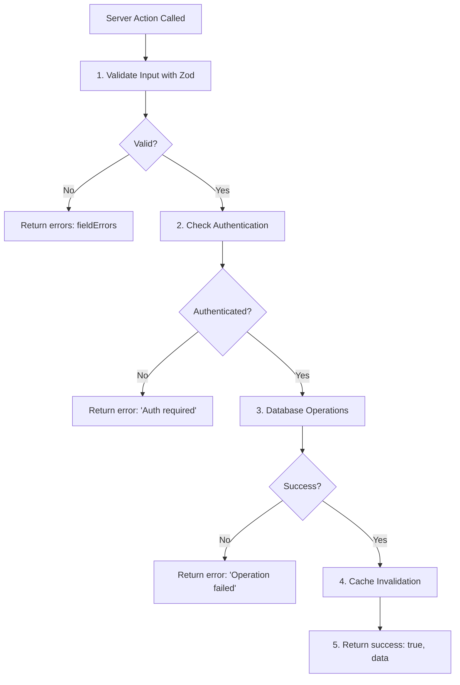
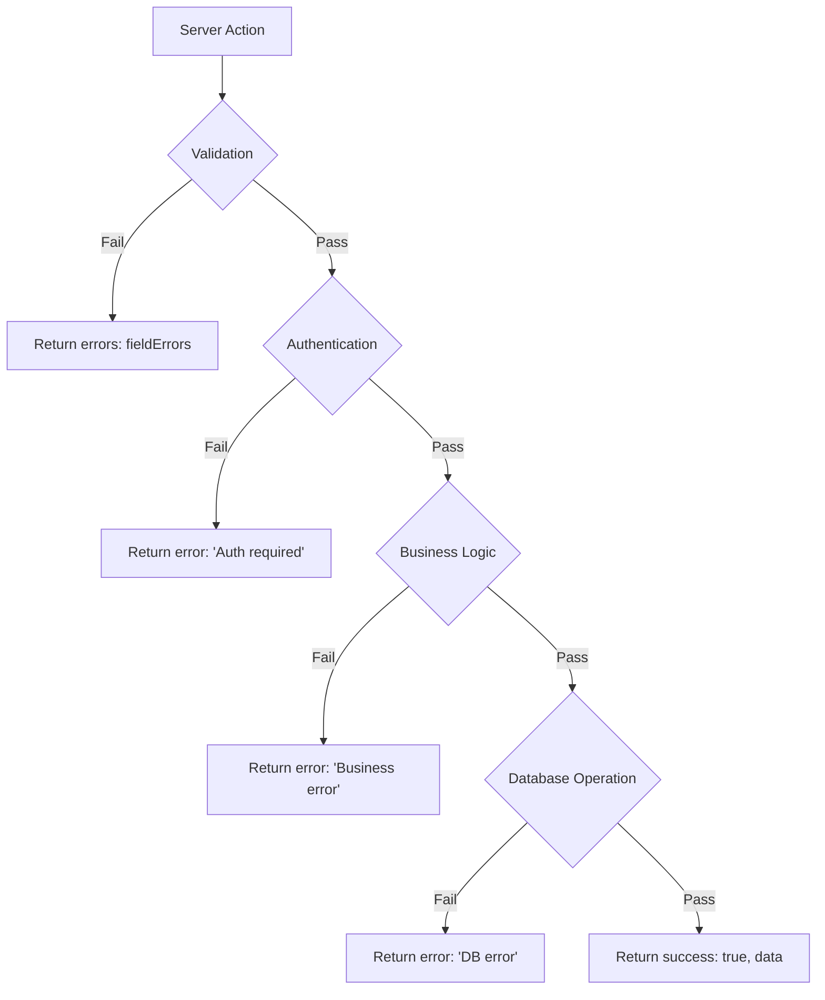

# Design Document: Server Actions Best Practices

## Overview

This design refactors the Server Actions implementation to align with Next.js 16 best practices as documented in Context7. The refactoring addresses critical issues in the current implementation:

1. **Current Issues:**
   - Authentication happens before validation (wastes resources)
   - Errors are thrown instead of returned (unpredictable error handling)
   - No structured FormState type definitions
   - Forms don't use useActionState hook (missing loading states and inline errors)
   - No Zod schemas for form validation

2. **Design Goals:**
   - Validate input first, authenticate second (fail fast on invalid data)
   - Return structured responses instead of throwing errors
   - Define type-safe FormState types for all Server Actions
   - Integrate forms with useActionState for progressive enhancement
   - Create reusable Zod schemas for validation
   - Maintain backward compatibility (same functionality, better structure)

3. **Scope:**
   - Refactor all Server Actions in `src/app/actions/items.ts`
   - Create shared types file for FormState definitions
   - Create shared Zod schemas file
   - Update form components to use useActionState
   - Preserve all existing functionality (cache invalidation, usage logging, module validation)

## Architecture

### High-Level Structure

```
src/
├── app/
│   └── actions/
│       ├── items.ts              # Refactored Server Actions
│       └── types.ts              # NEW: FormState type definitions
├── lib/
│   └── validations/
│       └── items.ts              # NEW: Zod schemas for item operations
└── modules/
    └── core/
        └── ui/
            └── ItemForm.tsx      # Updated to use useActionState
```

### Server Action Flow

The refactored Server Actions follow this strict order:



### Key Architectural Decisions

1. **Validation First:** Zod validation happens before any other operations to fail fast on invalid input
2. **Structured Responses:** All Server Actions return `{ success?, data?, error?, errors? }` instead of throwing
3. **FormData Input:** Server Actions accept `(prevState: FormState, formData: FormData)` for useActionState compatibility
4. **Type Safety:** FormState types ensure compile-time safety for form state handling
5. **Progressive Enhancement:** Forms work without JavaScript using native form submission

## Components and Interfaces

### FormState Type Definitions

**File:** `src/app/actions/types.ts`

```typescript
/**
 * Base FormState type for all Server Actions
 */
export type FormState<T = any> = {
  success?: boolean;
  data?: T;
  error?: string;
  errors?: Record<string, string[]>;
};

/**
 * FormState for createItem action
 */
export type CreateItemFormState = FormState<{
  id: string;
  type: string;
  name: string;
  ownerId: string;
  attributes: Record<string, any>;
  images: string[];
  status: 'in_use' | 'storage' | 'maintenance' | 'lost';
  createdAt: Date;
  updatedAt: Date;
}>;

/**
 * FormState for updateItem action
 */
export type UpdateItemFormState = FormState<{
  id: string;
  type: string;
  name: string;
  ownerId: string;
  attributes: Record<string, any>;
  images: string[];
  status: 'in_use' | 'storage' | 'maintenance' | 'lost';
  createdAt: Date;
  updatedAt: Date;
}>;

/**
 * FormState for deleteItem action
 */
export type DeleteItemFormState = FormState<{
  deleted: boolean;
}>;

/**
 * FormState for createUsageLog action
 */
export type CreateUsageLogFormState = FormState<{
  id: string;
  itemId: string;
  userId: string;
  action: string;
  snapshot: Record<string, any>;
  createdAt: Date;
}>;
```

### Zod Schema Definitions

**File:** `src/lib/validations/items.ts`

```typescript
import { z } from 'zod';

/**
 * Schema for createItem Server Action
 * Validates all required fields with user-friendly error messages
 */
export const createItemSchema = z.object({
  type: z.string().min(1, 'Item type is required'),
  name: z.string().min(1, 'Name is required').max(255, 'Name must be less than 255 characters'),
  attributes: z.record(z.any()).default({}),
  images: z.array(z.string().url('Invalid image URL')).optional().default([]),
  status: z.enum(['in_use', 'storage', 'maintenance', 'lost']).optional().default('storage'),
});

/**
 * Schema for updateItem Server Action
 * All fields are optional since this is a partial update
 */
export const updateItemSchema = z.object({
  id: z.string().min(1, 'Item ID is required'),
  name: z
    .string()
    .min(1, 'Name is required')
    .max(255, 'Name must be less than 255 characters')
    .optional(),
  status: z.enum(['in_use', 'storage', 'maintenance', 'lost']).optional(),
  attributes: z.record(z.any()).optional(),
  images: z.array(z.string().url('Invalid image URL')).optional(),
});

/**
 * Schema for deleteItem Server Action
 */
export const deleteItemSchema = z.object({
  id: z.string().min(1, 'Item ID is required'),
});

/**
 * Schema for createUsageLog Server Action
 */
export const createUsageLogSchema = z.object({
  itemId: z.string().min(1, 'Item ID is required'),
  action: z
    .string()
    .min(1, 'Action is required')
    .max(255, 'Action must be less than 255 characters'),
  snapshot: z.record(z.any()).optional().default({}),
});
```

### Refactored Server Actions

**File:** `src/app/actions/items.ts`

The Server Actions will be refactored to follow this pattern:

```typescript
export async function createItem(
  prevState: CreateItemFormState | undefined,
  formData: FormData
): Promise<CreateItemFormState> {
  // 1. VALIDATE INPUT FIRST
  const validatedFields = createItemSchema.safeParse({
    type: formData.get('type'),
    name: formData.get('name'),
    attributes: JSON.parse((formData.get('attributes') as string) || '{}'),
    images: JSON.parse((formData.get('images') as string) || '[]'),
    status: formData.get('status'),
  });

  if (!validatedFields.success) {
    return {
      errors: validatedFields.error.flatten().fieldErrors,
    };
  }

  // 2. CHECK AUTHENTICATION SECOND
  const session = await auth();
  if (!session?.user?.id) {
    return { error: 'Authentication required' };
  }

  // 3. MODULE VALIDATION (existing logic)
  const module = getModule(validatedFields.data.type);
  if (!module) {
    return { error: `Module ${validatedFields.data.type} not found` };
  }

  const moduleValidation = module.attributesSchema.safeParse(validatedFields.data.attributes);
  if (!moduleValidation.success) {
    return {
      errors: {
        attributes: moduleValidation.error.issues.map(
          err => `${err.path.join('.')}: ${err.message}`
        ),
      },
    };
  }

  // 4. DATABASE OPERATIONS
  try {
    const [item] = await db
      .insert(items)
      .values({
        type: validatedFields.data.type as any,
        name: validatedFields.data.name,
        ownerId: session.user.id,
        attributes: moduleValidation.data,
        images: validatedFields.data.images,
        status: validatedFields.data.status,
      })
      .returning();

    // 5. USAGE LOGGING (existing logic)
    await db.insert(usageLogs).values({
      itemId: item.id,
      userId: session.user.id,
      action: 'created',
      snapshot: {
        name: item.name,
        status: item.status,
        type: item.type,
      },
    });

    // 6. CACHE INVALIDATION (existing logic)
    updateTag('items');
    updateTag(`items-${validatedFields.data.type}`);
    updateTag('items-list');
    updateTag('usage-logs');
    revalidatePath(`/${validatedFields.data.type}`);
    revalidatePath('/');

    // 7. RETURN SUCCESS
    return { success: true, data: item };
  } catch (error) {
    console.error('Failed to create item:', error);
    return { error: 'Failed to create item. Please try again.' };
  }
}
```

### Updated Form Components

**File:** `src/modules/core/ui/ItemForm.tsx`

The form component will be updated to use useActionState:

```typescript
'use client';

import { useActionState } from 'react';
import { createItem } from '@/app/actions/items';
import { CreateItemFormState } from '@/app/actions/types';

export function ItemForm({ moduleType, initialData }: ItemFormProps) {
  const [state, formAction, isPending] = useActionState<CreateItemFormState, FormData>(
    createItem,
    undefined
  );

  return (
    <form action={formAction} className="space-y-6">
      {/* Global error display */}
      {state?.error && (
        <div className="bg-destructive/10 text-destructive px-4 py-3 rounded-md">
          {state.error}
        </div>
      )}

      {/* Name field with inline error */}
      <div className="space-y-2">
        <Label htmlFor="name">Name *</Label>
        <Input
          id="name"
          name="name"
          defaultValue={initialData?.name}
          required
          aria-invalid={state?.errors?.name ? 'true' : 'false'}
          aria-describedby={state?.errors?.name ? 'name-error' : undefined}
        />
        {state?.errors?.name && (
          <p id="name-error" className="text-sm text-destructive">
            {state.errors.name[0]}
          </p>
        )}
      </div>

      {/* Submit button with loading state */}
      <Button type="submit" disabled={isPending}>
        {isPending ? 'Saving...' : 'Save'}
      </Button>
    </form>
  );
}
```

### Error Display Component

**File:** `src/components/ui/form-error.tsx`

A reusable component for displaying form errors:

```typescript
interface FormErrorProps {
  error?: string;
  errors?: Record<string, string[]>;
  fieldName?: string;
}

export function FormError({ error, errors, fieldName }: FormErrorProps) {
  if (fieldName && errors?.[fieldName]) {
    return (
      <p className="text-sm text-destructive mt-1">
        {errors[fieldName][0]}
      </p>
    );
  }

  if (error) {
    return (
      <div className="bg-destructive/10 text-destructive px-4 py-3 rounded-md">
        {error}
      </div>
    );
  }

  return null;
}
```

## Data Models

### FormState Structure

All Server Actions return a consistent FormState structure:

```typescript
type FormState<T> = {
  success?: boolean; // True when operation succeeds
  data?: T; // Result data on success
  error?: string; // Global error message
  errors?: Record<string, string[]>; // Field-specific validation errors
};
```

**Field Descriptions:**

- `success`: Boolean flag indicating successful operation (only present on success)
- `data`: The result data (item, log, etc.) returned on successful operations
- `error`: A single global error message (authentication, database, etc.)
- `errors`: Object mapping field names to arrays of error messages (validation errors)

**Mutual Exclusivity:**

- Success case: `{ success: true, data: {...} }`
- Validation error case: `{ errors: { fieldName: ['error message'] } }`
- Global error case: `{ error: 'error message' }`

### FormData Structure

Server Actions receive FormData with these fields:

**createItem FormData:**

- `type`: string (module type)
- `name`: string (item name)
- `attributes`: JSON string (module-specific attributes)
- `images`: JSON string (array of image URLs)
- `status`: string (optional, defaults to 'storage')

**updateItem FormData:**

- `id`: string (item ID)
- `name`: string (optional)
- `status`: string (optional)
- `attributes`: JSON string (optional)
- `images`: JSON string (optional)

**deleteItem FormData:**

- `id`: string (item ID)

**createUsageLog FormData:**

- `itemId`: string (item ID)
- `action`: string (action description)
- `snapshot`: JSON string (optional snapshot data)

## Correctness Properties

_A property is a characteristic or behavior that should hold true across all valid executions of a system—essentially, a formal statement about what the system should do. Properties serve as the bridge between human-readable specifications and machine-verifiable correctness guarantees._

### Property Reflection

After analyzing the acceptance criteria, I identified several redundant properties that can be consolidated:

**Redundancies Identified:**

1. Properties 1.1, 2.1, and 2.4 all test operation order (validation before auth) - can be combined
2. Properties 1.2 and 3.2 both test validation error response structure - can be combined
3. Properties 2.2 and 3.3 both test auth error response structure - can be combined
4. Properties 5.1 and 10.2 both test useActionState usage - redundant
5. Properties 3.1 subsumes all other error handling properties (3.2, 3.3, 3.4) - they test specific cases of "no exceptions thrown"

**Consolidated Properties:**

- Combine 1.1, 2.1, 2.4 into one property about operation order
- Combine 1.2 and 3.2 into one property about validation error responses
- Combine 2.2 and 3.3 into one property about auth error responses
- Keep 3.1 as the general "no exceptions" property, with 3.2-3.4 as specific examples
- Remove 10.2 as redundant with 5.1

### Properties

**Property 1: Validation Before Authentication**
_For any_ Server Action and any FormData input, validation SHALL complete before any authentication check is performed, ensuring invalid data fails fast without wasting authentication resources.
**Validates: Requirements 1.1, 2.1, 2.4**

**Property 2: Validation Failure Response Structure**
_For any_ Server Action and any invalid FormData input, the response SHALL contain an `errors` field mapping field names to error message arrays, and SHALL NOT proceed to authentication or database operations.
**Validates: Requirements 1.2, 3.2**

**Property 3: Authentication Success Proceeds to Database**
_For any_ Server Action with valid input and successful authentication, database operations SHALL be executed.
**Validates: Requirements 2.3**

**Property 4: No Exceptions Thrown**
_For any_ Server Action and any input (valid or invalid), the function SHALL return a Structured_Response object and SHALL NOT throw an exception.
**Validates: Requirements 3.1**

**Property 5: Authentication Failure Response Structure**
_For any_ Server Action with valid input but failed authentication, the response SHALL contain an `error` field with a user-friendly message.
**Validates: Requirements 2.2, 3.3**

**Property 6: Database Failure Response Structure**
_For any_ Server Action where database operations fail, the response SHALL contain an `error` field with a user-friendly message that does not expose internal details.
**Validates: Requirements 3.4, 9.3**

**Property 7: Success Response Structure**
_For any_ Server Action where all operations succeed, the response SHALL contain `success: true` and a `data` field with the result.
**Validates: Requirements 3.5**

**Property 8: Response Serializability**
_For any_ Server Action response, the response SHALL be serializable via JSON.stringify and JSON.parse without loss of data or errors.
**Validates: Requirements 3.6**

**Property 9: Form Loading State Display**
_For any_ form component using a Server Action, when the form is submitting (pending is true), a loading state SHALL be displayed.
**Validates: Requirements 5.2**

**Property 10: Field Error Display**
_For any_ form component with validation errors in FormState, error messages SHALL be displayed next to the corresponding input fields.
**Validates: Requirements 5.3**

**Property 11: Global Error Display**
_For any_ form component with a global error in FormState, the error message SHALL be displayed prominently.
**Validates: Requirements 5.4**

**Property 12: Submit Button Disabled When Pending**
_For any_ form component, when the form is pending, the submit button SHALL be disabled.
**Validates: Requirements 5.5**

**Property 13: Zod Schema Validates Required Fields**
_For any_ Zod schema and any input missing required fields, validation SHALL fail with specific error messages.
**Validates: Requirements 6.2**

**Property 14: Zod Schema Error Message Quality**
_For any_ Zod schema validation failure, error messages SHALL be user-friendly and specific to the field and constraint.
**Validates: Requirements 6.3, 9.1**

**Property 15: Optional Field Handling**
_For any_ Zod schema with optional fields, validation SHALL pass when optional fields are omitted.
**Validates: Requirements 6.4**

**Property 16: Cache Invalidation on Success**
_For any_ Server Action that successfully modifies data, updateTag() SHALL be called with appropriate cache tags.
**Validates: Requirements 7.1**

**Property 17: Path Revalidation on Success**
_For any_ Server Action that successfully modifies data, revalidatePath() SHALL be called for affected routes.
**Validates: Requirements 7.2**

**Property 18: Cache Tag Format**
_For any_ Server Action that invalidates cache, the cache tags SHALL follow the pattern: 'items', 'items-{type}', 'items-{id}', 'usage-logs'.
**Validates: Requirements 7.4**

**Property 19: Usage Logging Preservation**
_For any_ Server Action that modifies data, a usage log entry SHALL be created with the same structure as the original implementation.
**Validates: Requirements 8.2**

**Property 20: Module Schema Validation**
_For any_ Server Action that creates or updates items, module-specific Zod schemas SHALL be used for attribute validation.
**Validates: Requirements 8.3**

**Property 21: Data Structure Preservation**
_For any_ Server Action, the data returned in the success response SHALL contain the same fields as the original implementation.
**Validates: Requirements 8.5**

**Property 22: Error Messages Exclude Sensitive Information**
_For any_ error response, the error message SHALL NOT contain stack traces, SQL queries, or other sensitive internal details.
**Validates: Requirements 9.4**

## Error Handling

### Error Categories

The refactored Server Actions handle four categories of errors:

1. **Validation Errors (Field-Specific)**
   - Trigger: Invalid input data
   - Response: `{ errors: { fieldName: ['error message'] } }`
   - Example: Missing required field, invalid format, constraint violation

2. **Authentication Errors**
   - Trigger: No session or invalid session
   - Response: `{ error: 'Authentication required' }`
   - Example: User not logged in, session expired

3. **Business Logic Errors**
   - Trigger: Module not found, item not found, ownership violation
   - Response: `{ error: 'User-friendly message' }`
   - Example: "Module not found", "Item not found"

4. **Database Errors**
   - Trigger: Database operation failure
   - Response: `{ error: 'Failed to [operation]. Please try again.' }`
   - Example: Connection error, constraint violation, timeout

### Error Handling Flow



### Error Message Guidelines

1. **User-Friendly:** Avoid technical jargon, stack traces, or internal details
2. **Actionable:** Tell users what went wrong and how to fix it
3. **Consistent:** Use similar tone and format across all errors
4. **Specific:** Validation errors should identify the field and constraint
5. **Safe:** Never expose sensitive information (SQL, credentials, internal paths)

### Error Examples

**Good Error Messages:**

- "Name is required"
- "Email must be a valid email address"
- "Authentication required"
- "Failed to create item. Please try again."

**Bad Error Messages:**

- "Error: undefined is not a function" (technical)
- "SQL error: duplicate key violation on items_pkey" (exposes internals)
- "Something went wrong" (not specific)
- "/var/www/app/db/items.ts:42 - TypeError" (exposes paths)

## Testing Strategy

### Dual Testing Approach

This feature requires both unit tests and property-based tests for comprehensive coverage:

**Unit Tests:**

- Specific examples of valid and invalid inputs
- Edge cases (empty strings, null values, boundary conditions)
- Integration points (form submission, error display)
- Backward compatibility (comparing old vs new behavior)

**Property-Based Tests:**

- Universal properties that hold for all inputs
- Validation behavior across random inputs
- Response structure consistency
- Error handling across all error types

### Property-Based Testing Configuration

**Library:** We'll use `fast-check` for TypeScript property-based testing.

**Configuration:**

- Minimum 100 iterations per property test
- Each test tagged with: `Feature: server-actions-best-practices, Property {number}: {property_text}`
- Tests organized by Server Action (createItem, updateItem, deleteItem, createUsageLog)

### Test Organization

```
src/
└── __tests__/
    ├── actions/
    │   ├── items.test.ts              # Unit tests for Server Actions
    │   ├── items.properties.test.ts   # Property-based tests
    │   └── items.integration.test.ts  # Integration tests with forms
    ├── validations/
    │   ├── items.test.ts              # Unit tests for Zod schemas
    │   └── items.properties.test.ts   # Property-based tests for schemas
    └── components/
        └── ItemForm.test.ts           # Unit tests for form components
```

### Key Test Scenarios

**Unit Tests:**

1. Valid input creates item successfully
2. Missing required field returns validation error
3. Invalid email format returns validation error
4. Unauthenticated request returns auth error
5. Module not found returns business logic error
6. Database error returns user-friendly error
7. Form displays loading state when pending
8. Form displays field errors inline
9. Form displays global errors prominently
10. Submit button disabled when pending

**Property-Based Tests:**

1. Validation always happens before authentication (Property 1)
2. Invalid input always returns errors field (Property 2)
3. No exceptions are ever thrown (Property 4)
4. All responses are serializable (Property 8)
5. Cache tags always follow the pattern (Property 18)
6. Error messages never contain sensitive info (Property 22)

### Backward Compatibility Testing

To ensure the refactoring doesn't break existing functionality:

1. **Database Operations:** Compare SQL queries before and after refactoring
2. **Usage Logging:** Verify log entries have the same structure
3. **Cache Invalidation:** Verify same cache tags are invalidated
4. **Data Structures:** Verify returned data has the same fields (wrapped in response)
5. **Module Validation:** Verify module schemas are still used

### Testing Tools

- **Jest:** Test runner and assertion library
- **fast-check:** Property-based testing library
- **React Testing Library:** Component testing
- **MSW (Mock Service Worker):** API mocking for integration tests
- **@testing-library/user-event:** User interaction simulation

### Test Coverage Goals

- **Unit Test Coverage:** 90%+ for Server Actions and Zod schemas
- **Property Test Coverage:** All 22 properties implemented
- **Integration Test Coverage:** All form submission flows
- **Backward Compatibility:** 100% of existing functionality preserved
